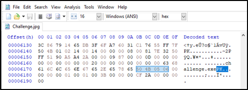
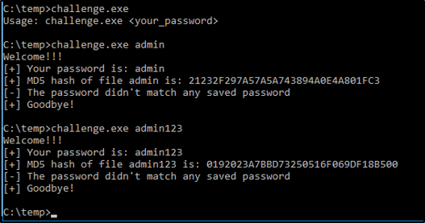

# Reverse engineering - challenge 1
You need to find the flag in the form of: {artist name - song name}.
The complete challenge file is under the directory: the_challenge.
If you want you can only practice the executable file which is under the directory: setup_files.

# setup_file
* challenge.c - The challenge program itself.
* hetText.c - Helper program to convert sentences in ASCII-string format to Hex-string format.
* hexTextOutput.txt - Contains the sentences used in the challenge.c file.
* Hashes.txt - Contains MD5 hashes of passwords used in the challenge.c file.
* Reverse-Memes.jpg - Picture for the challenge.
* challenge.exe - The compiled challenge executable file.

# Compiling the challenge
1. Make sure gcc installed.
2. Open command prompt.
3. Type: <code>gcc -o challenge.exe challenge.c</code>
4. Type: <code>copy /b challenge.exe + Reverse-Memes.jpg Challenge.jpg</code>
4. Have fun!

# Detailed solution
1. Open the <code>.jpg</code> file in Hex-Editor.
2. Search for <code>PK..</code>, magic-number for <code>.zip</code> files.

3. Change the file extension to <code>.zip</code> and open the archive.
4. Extract the challenge.exe file.
5. Open command-prompt and try some password.

6. Open the executable file in IDA and analyse the binary.
7. 
